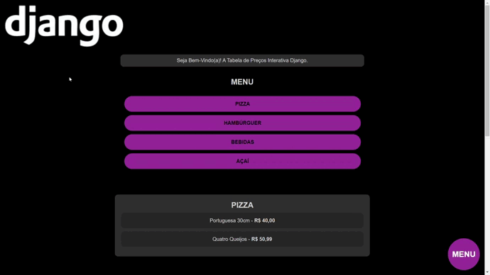
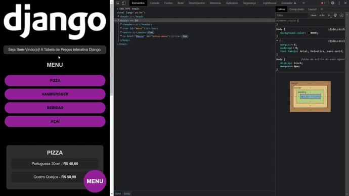

# Tabela de Preços Interativa

## Descrição

Este sistema foi desenvolvido com o Python e o Django Framework, ele utiliza o Django Admin para gerenciar a 
listagem de produtos por categoria na pagina index do projeto. 

## Requisitos

 - Python 3.10.9
 - Django 4.1.7

## Imagem do Projeto

## O layout do sistema é 100% responsivo!

<a href="https://www.linkedin.com/feed/update/urn:li:activity:7032764429154795520/">Clique aqui  para ver o vídeo do projeto no Linkedin.</a>
